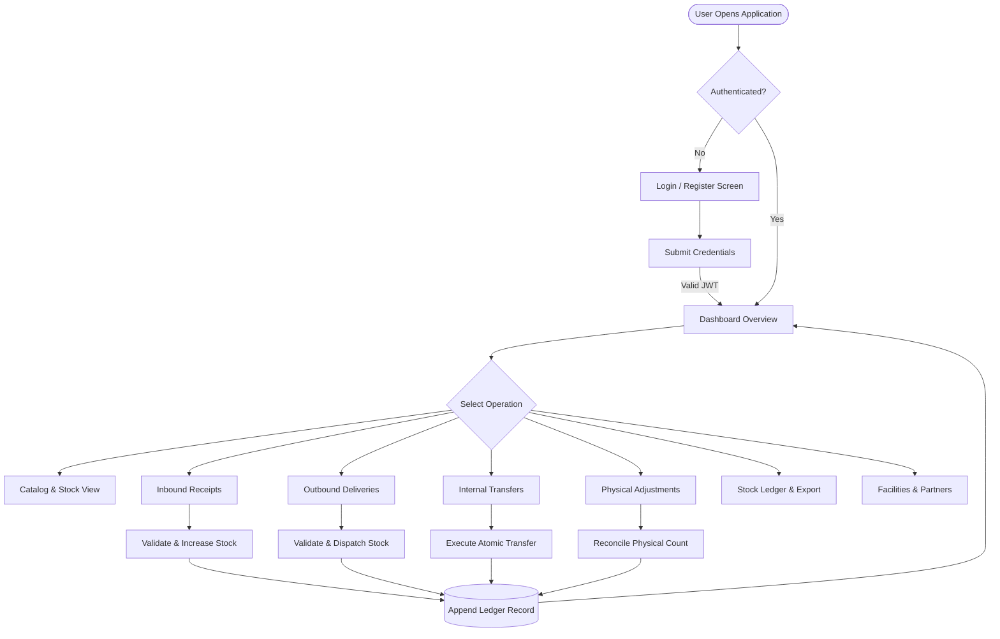
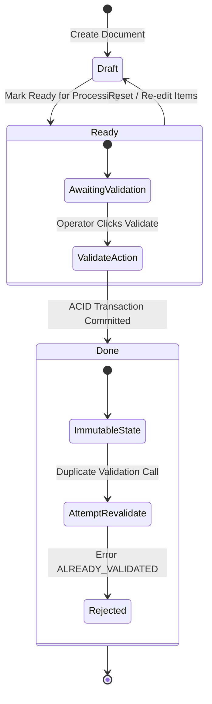
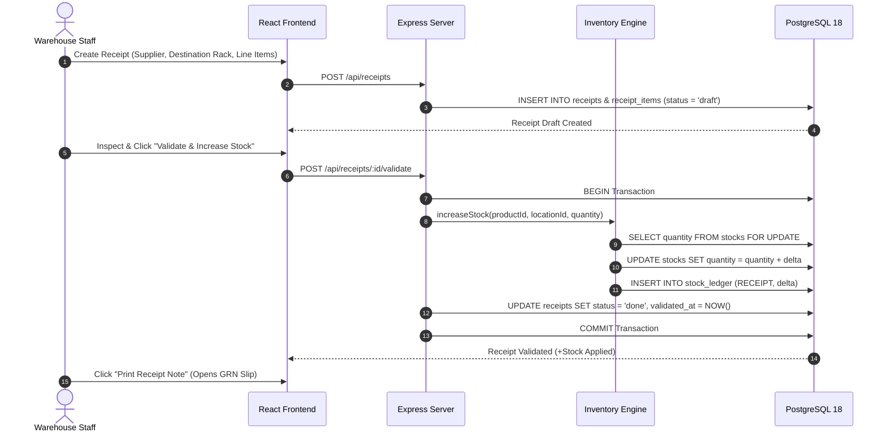
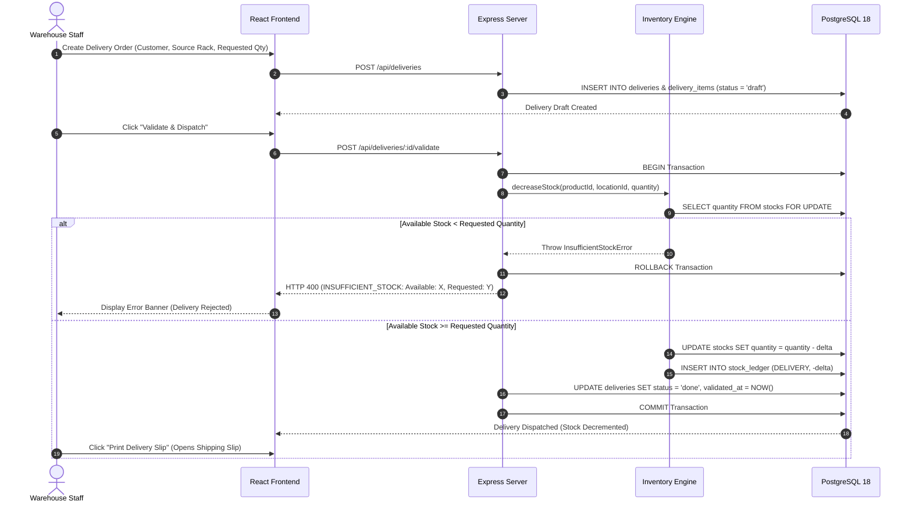
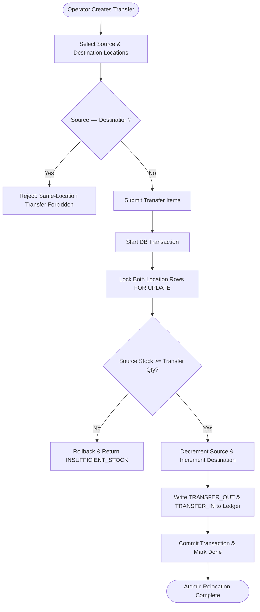
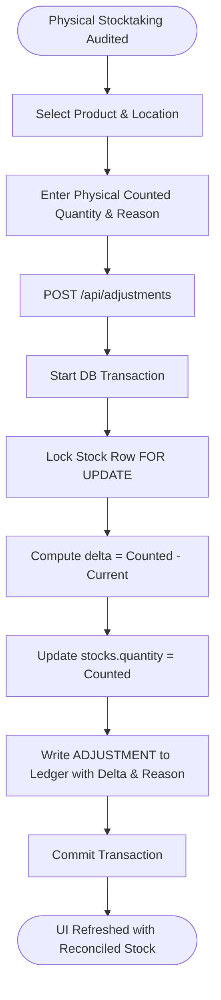

# StockSense — Application Flow & State Machines (APP FLOW)

**Project Name:** StockSense  
**Hackathon:** Odoo x LPU Jalandhar Hackathon 2026  
**Document Version:** 1.0.0  
**Target Release:** Production / Hackathon Final Submission  
**Repository:** [STOCK-SENSE-ODOO-x-LPU](https://github.com/manas0306-ops/STOCK-SENSE-ODOO-x-LPU)  

---

## 1. High-Level User Journey

The StockSense user journey guides warehouse operators and managers through authenticated, transactional workflows:



---

## 2. Document Lifecycle State Machine

All primary operational documents (Receipts, Deliveries, and Transfers) share a rigorous three-state lifecycle with strict idempotency guards:



### Lifecycle Invariants:
1. **Draft:** Line items can be added, updated, or removed. No stock quantities or ledger records are modified.
2. **Ready:** Document is verified and staged for fulfillment.
3. **Done (Finalized):**
   * Inventory balances in `stocks` updated.
   * Event logged in `stock_ledger`.
   * Validation timestamp and operator recorded.
   * **Idempotency Guarantee:** Attempting to validate a document in `done` status returns HTTP 400 (`ALREADY_VALIDATED`).

---

## 3. Detailed Operational Workflows

### 3.1 Inbound Receiving Flow (Receipts)



---

### 3.2 Outbound Delivery Flow (Fulfillment & Over-Stock Prevention)



---

### 3.3 Internal Relocation Flow (Transfers)



---

### 3.4 Physical Count Adjustment Flow



---

## 4. Frontend Route Navigation Architecture

```
/ (Redirects to /dashboard or /login)
│
├── /login          [PublicRoute] Fast-fill Judge Demo Credentials
├── /register       [PublicRoute] User registration
│
└── AppLayout       [ProtectedRoute] Requires valid JWT token
    ├── /dashboard    Live KPI cards, low-stock banner, pending operations
    ├── /products     Product catalog, multi-location stock, CSV export
    ├── /receipts     Inbound vendor shipments, GRN generation & print
    ├── /deliveries   Outbound customer shipments, delivery slip & print
    ├── /transfers    Internal atomic stock movements between racks
    ├── /adjustments  Physical count reconciliation & variance auditing
    ├── /ledger       Immutable audit log, multi-filter queries, CSV export
    └── /settings     Warehouse definitions, location hierarchy, partners
```
