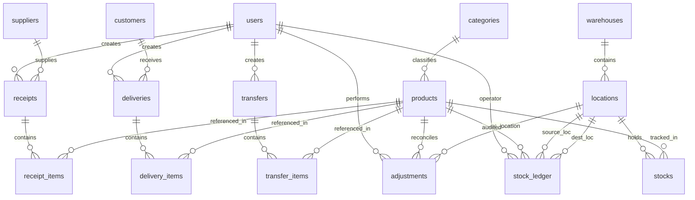

# StockSense — Technical Requirements Document (TRD)

**Project Name:** StockSense  
**Hackathon:** Odoo x LPU Jalandhar Hackathon 2026  
**Document Version:** 1.0.0  
**Target Release:** Production / Hackathon Final Submission  
**Repository:** [STOCK-SENSE-ODOO-x-LPU](https://github.com/manas0306-ops/STOCK-SENSE-ODOO-x-LPU)  

---

## 1. System Architecture Overview

StockSense is structured as a decoupled, three-tier enterprise client-server system designed around transactional database persistence:

```
┌────────────────────────────────────────────────────────┐
│                   Presentation Layer                   │
│          React 18 + Vite + TailwindCSS (Port 5173)     │
└───────────────────────────┬────────────────────────────┘
                            │ HTTPS / JSON REST API
┌───────────────────────────▼────────────────────────────┐
│                    Application Layer                   │
│                Express.js Server (Port 5000)           │
│  ┌───────────────────────┐   ┌──────────────────────┐  │
│  │ JWT Authentication &  │   │ Centralized          │  │
│  │ Role Middleware       │   │ Inventory Engine     │  │
│  └───────────────────────┘   └──────────────────────┘  │
│  ┌───────────────────────┐   ┌──────────────────────┐  │
│  │ Route Controllers &   │   │ Unified Error & SQL  │  │
│  │ Input Validators      │   │ Constraint Handler   │  │
│  └───────────────────────┘   └──────────────────────┘  │
└───────────────────────────┬────────────────────────────┘
                            │ node-postgres (pg.Pool)
┌───────────────────────────▼────────────────────────────┐
│                    Persistence Layer                   │
│               PostgreSQL 18 (Port 5433)                │
│  - ACID Transactions (BEGIN / COMMIT / ROLLBACK)       │
│  - Pessimistic Row Locking (SELECT ... FOR UPDATE)     │
│  - Single Source of Truth (`stocks` Table)             │
│  - Immutable Audit Trail (`stock_ledger` Table)        │
│  - Zero Negative Stock Database Constraints            │
└────────────────────────────────────────────────────────┘
```

---

## 2. Technology Stack & Component Specifications

| Tier | Component / Library | Version | Technical Purpose |
| :--- | :--- | :--- | :--- |
| **Frontend** | React | `^18.3.1` | Declarative UI rendering & state management. |
| | Vite | `^6.4.3` | High-performance ES-module build engine & dev server. |
| | TailwindCSS | `^3.4.17` | Utility-first responsive styling and typography. |
| | React Router DOM | `^6.28.1` | Client-side routing with authentication guards. |
| | Lucide React | `^0.468.0` | Lightweight SVG icon system. |
| **Backend** | Node.js | `v20+` / `v24+` | Event-driven JavaScript runtime environment. |
| | Express.js | `^4.21.2` | RESTful routing and middleware pipeline. |
| | pg (node-postgres)| `^8.13.1` | PostgreSQL client with transactional connection pooling. |
| | bcryptjs | `^2.4.3` | Password hashing with salt factor 10. |
| | jsonwebtoken | `^9.0.2` | Signed JWT token generation and verification. |
| | cors | `^2.8.5` | Cross-Origin Resource Sharing configuration. |
| **Database** | PostgreSQL | `18.6` | Relational ACID database with row-level locking. |
| **Testing** | Node.js Test Runner | Native (`node:test`)| Zero-dependency unit, concurrency, and API integration testing. |

---

## 3. Database Schema & Data Modeling

The database schema consists of **16 normalized tables** enforcing relational integrity, foreign keys with cascade safety, unique constraints, and check validations.

### 3.1 Entity Relationship Diagram



### 3.2 Critical Schema Constraints

1. **Zero Negative Stock Constraint (`stocks` table):**
   ```sql
   CONSTRAINT positive_quantity CHECK (quantity >= 0)
   ```
2. **Product-Location Uniqueness:**
   ```sql
   CONSTRAINT unique_product_location UNIQUE (product_id, location_id)
   ```
3. **SKU Uniqueness:**
   ```sql
   CONSTRAINT products_sku_key UNIQUE (sku)
   ```
4. **Email Uniqueness:**
   ```sql
   CONSTRAINT users_email_key UNIQUE (email)
   ```

---

## 4. Central Inventory Engine Specification

All balance mutations are strictly governed by `InventoryEngine` (`backend/src/services/inventoryEngine.js`). Direct queries modifying `stocks` outside this service are strictly prohibited.

### 4.1 Core Engine Methods

#### `increaseStock(client, productId, locationId, quantity, userId, referenceType, referenceId, reason)`
* **Purpose:** Safely increments physical stock at a location (used by Inbound Receipts).
* **Algorithm:**
  1. Acquire row lock via `SELECT id, quantity FROM stocks WHERE product_id = $1 AND location_id = $2 FOR UPDATE`.
  2. If record does not exist, insert initial stock record (`quantity = 0`).
  3. Calculate `newQuantity = currentStock + quantity`.
  4. Update `stocks` row with `newQuantity`.
  5. Insert audit row into `stock_ledger` with `operation_type = 'RECEIPT'`.
  6. Return `{ previousStock, newStock, delta: quantity }`.

#### `decreaseStock(client, productId, locationId, quantity, userId, referenceType, referenceId, reason)`
* **Purpose:** Safely decrements physical stock at a location (used by Outbound Deliveries).
* **Algorithm:**
  1. Acquire row lock via `SELECT id, quantity FROM stocks WHERE product_id = $1 AND location_id = $2 FOR UPDATE`.
  2. If record does not exist or `currentStock < quantity`:
     * Throw `InsufficientStockError(available, requested)`.
  3. Calculate `newQuantity = currentStock - quantity`.
  4. Update `stocks` row with `newQuantity`.
  5. Insert audit row into `stock_ledger` with `operation_type = 'DELIVERY'`.
  6. Return `{ previousStock, newStock, delta: -quantity }`.

#### `transferStock(client, productId, fromLocationId, toLocationId, quantity, userId, referenceType, referenceId, reason)`
* **Purpose:** Atomically relocates stock between two locations within a single transaction.
* **Algorithm:**
  1. Validate `fromLocationId !== toLocationId`.
  2. Acquire locks on both locations in consistent primary key order (prevents database deadlocks).
  3. Verify `fromLocation` has sufficient stock (`currentStock >= quantity`).
  4. Decrement `fromLocation` by `quantity`.
  5. Increment `toLocation` by `quantity`.
  6. Insert two ledger audit entries: `TRANSFER_OUT` and `TRANSFER_IN`.
  7. Return `{ fromStock, toStock, quantityTransferred: quantity }`.

#### `setStock(client, productId, locationId, newQuantity, userId, referenceType, referenceId, reason)`
* **Purpose:** Reconciles physical count variances (used by Inventory Adjustments).
* **Algorithm:**
  1. Acquire row lock via `SELECT ... FOR UPDATE`.
  2. Calculate `delta = newQuantity - currentStock`.
  3. Update `stocks` row with `newQuantity`.
  4. Insert audit row into `stock_ledger` with `operation_type = 'ADJUSTMENT'`, storing `delta` and `reason`.
  5. Return `{ previousStock, newStock, delta }`.

---

## 5. Concurrency & Transaction Management

To guarantee zero race conditions when multiple workers fulfill orders concurrently:
1. **Pessimistic Row Locking:** `SELECT ... FOR UPDATE` serializes concurrent accesses to the same SKU-location tuple.
2. **Transaction Isolation:** Standard PostgreSQL Read Committed isolation combined with explicit row locks ensures transactions only observe finalized, committed state.
3. **Deadlock Avoidance:** Multi-row locks (such as inter-location transfers) sort location IDs numerically before acquiring row locks, eliminating cyclic wait conditions.

---

## 6. Authentication & Security Architecture

* **Authentication Protocol:** JSON Web Tokens (JWT) signed with HMAC-SHA256 (`HS256`).
* **Token Structure:**
  ```json
  {
    "id": 1,
    "email": "manager@stocksense.com",
    "role": "Inventory Manager",
    "iat": 1790420000,
    "exp": 1790506400
  }
  ```
* **Transport:** Client supplies token in the standard HTTP header:
  `Authorization: Bearer <token>`
* **Role-Based Access Control (RBAC):**
  * `Inventory Manager`: Full read/write access across Catalog, Facilities, Operations, Adjustments, and System Settings.
  * `Warehouse Staff`: Operational read/write access for Receipts, Deliveries, and Transfers; restricted from modifying system settings or overriding reorder thresholds.

---

## 7. REST API Endpoints Specification

| Method | Endpoint | Access Role | Description |
| :--- | :--- | :--- | :--- |
| `POST` | `/api/auth/register` | Public | Register new user account. |
| `POST` | `/api/auth/login` | Public | Authenticate user & issue JWT token. |
| `GET` | `/api/auth/me` | Authenticated | Retrieve current user profile. |
| `GET` | `/api/dashboard` | Authenticated | Retrieve real-time KPIs, pending ops, and stock stats. |
| `GET` | `/api/products` | Authenticated | List all products with calculated multi-location stock. |
| `GET` | `/api/products/:id`| Authenticated | Get detailed product breakdown by location. |
| `POST` | `/api/products` | Manager | Create new product SKU. |
| `PUT` | `/api/products/:id`| Manager | Update product attributes and reorder level. |
| `DELETE`| `/api/products/:id`| Manager | Remove product from catalog. |
| `GET` | `/api/receipts` | Authenticated | List inbound receipts with filter by status. |
| `POST` | `/api/receipts` | Staff / Manager| Create new draft receipt. |
| `POST` | `/api/receipts/:id/validate`| Staff / Manager| Execute atomic receipt stock increment. |
| `GET` | `/api/deliveries` | Authenticated | List outbound delivery orders. |
| `POST` | `/api/deliveries` | Staff / Manager| Create new draft delivery. |
| `POST` | `/api/deliveries/:id/validate`| Staff / Manager| Execute outbound stock decrement with over-delivery check. |
| `GET` | `/api/transfers` | Authenticated | List internal transfers. |
| `POST` | `/api/transfers` | Staff / Manager| Create new draft transfer. |
| `POST` | `/api/transfers/:id/validate`| Staff / Manager| Execute atomic relocation between locations. |
| `POST` | `/api/adjustments` | Manager | Reconcile physical count and write audit reason. |
| `GET` | `/api/ledger` | Authenticated | Query historical audit trail with multi-filter support. |
| `GET` | `/api/warehouses` | Authenticated | List warehouses and nested locations. |
| `GET` | `/api/locations` | Authenticated | List individual functional locations. |
| `GET` | `/api/suppliers` | Authenticated | List registered vendor partners. |
| `GET` | `/api/customers` | Authenticated | List registered customer partners. |

---

## 8. Error Handling & SQL Constraint Translation

The backend centralizes error handling in `backend/src/middleware/errorHandler.js`, mapping low-level database constraints to clear, actionable HTTP status codes and error bodies:

| PostgreSQL Code | Error Name | HTTP Status | Response Code | User-Facing Description |
| :--- | :--- | :--- | :--- | :--- |
| `23505` | Unique Violation | `400 Bad Request` | `DUPLICATE_KEY` | Resource with this unique key (SKU, Email) already exists. |
| `23503` | Foreign Key Violation| `400 Bad Request`| `FOREIGN_KEY_VIOLATION`| Referenced entity (Location, Supplier, Product) does not exist. |
| `23514` | Check Violation | `400 Bad Request` | `CHECK_VIOLATION` | Operation violates database positive quantity constraint. |
| N/A | `InsufficientStockError`| `400 Bad Request` | `INSUFFICIENT_STOCK`| Requested dispatch quantity exceeds available location balance. |
| N/A | `UnauthorizedError` | `401 Unauthorized` | `UNAUTHORIZED` | Invalid credentials or missing/expired JWT token. |
| N/A | `NotFoundError` | `404 Not Found` | `NOT_FOUND` | Requested document or resource does not exist. |

---

## 9. Environment & Port Configurations

```env
# Server Configuration
PORT=5000
NODE_ENV=development

# Database Configuration
DB_HOST=localhost
DB_PORT=5433
DB_NAME=stocksense_db
DB_USER=postgres
DB_PASSWORD=postgres

# Security
JWT_SECRET=stocksense_production_secret_key_2026_odoo_hackathon
JWT_EXPIRES_IN=24h

# Frontend Client URL
CLIENT_URL=http://localhost:5173
```
